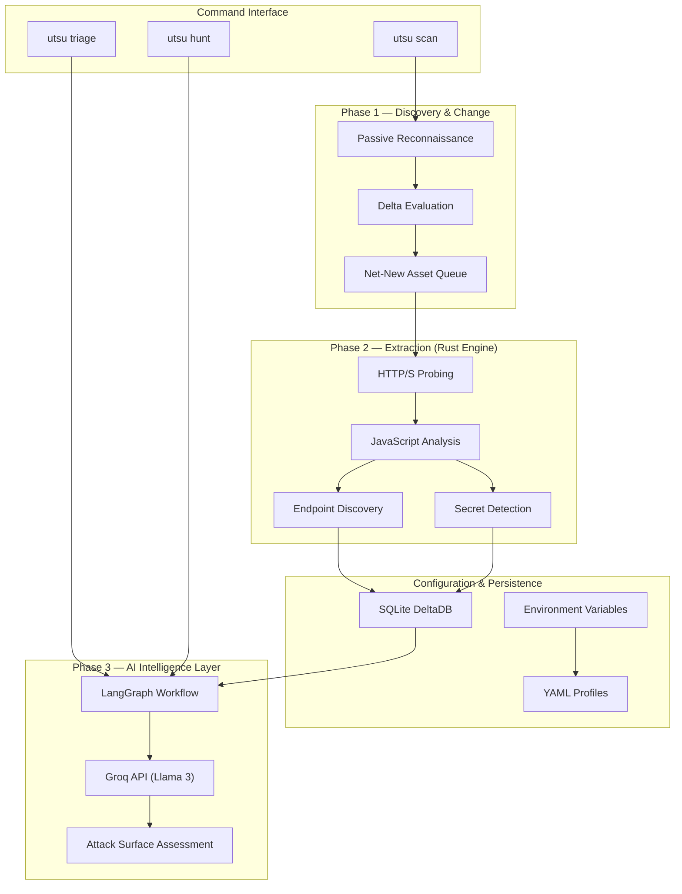

<div align="center">

# UTSU (移ろい)

### Attack Surface Intelligence Platform

Autonomous Reconnaissance • State-Aware Discovery • JavaScript Intelligence • AI-Assisted Analysis

---

<p align="center">


</p>

### Continuous Discovery. High-Speed Intelligence. Actionable Findings.

Attack surfaces change faster than security teams can track them. UTSU is an offensive security framework designed to discover those changes, explain their impact, and help operators focus on what matters next. 

Built for penetration testers, red teams, and security engineers, UTSU consolidates reconnaissance, enrichment, and Groq-powered AI analysis into a single automated workflow.

</div>

---

## Why UTSU?

Traditional reconnaissance workflows (e.g., BBOT, Amass) rely on fragmented tooling and stateless execution—they run massive sweeps to find assets at a single point in time, with no memory of what existed yesterday. 

UTSU shifts the focus from raw discovery volume to **stateful context**:

| Feature | Traditional Frameworks | UTSU |
| :--- | :--- | :--- |
| **Primary Objective** | Maximum asset discovery | Differential change detection |
| **State Retention** | Stateless (Run-and-forget) | Stateful (Persistent DeltaDB Tracking) |
| **Analysis Model** | Manual log parsing / Grep | Automated Evidence-Based Analysis |
| **Noise Profile** | High (Regenerates static data) | Low (Isolates net-new asset deltas) |

The goal of UTSU is not merely to find more assets, but to explicitly isolate what changed, analyze the resulting attack vectors, and minimize the time between asset exposure and remediation.

---

## Platform Architecture

UTSU follows a modular intelligence lifecycle. Execution is split across three specialized layers to balance high-throughput native processing with flexible AI orchestration.

* **The Orchestrator (Python):** Manages local state persistence, profile ingestion, concurrency loops, and external tool integration.
* **The Engine (Rust/PyO3):** A multithreaded, memory-safe native core compiled to handle heavy DOM extraction and JavaScript intelligence parsing at hardware speeds.
* **The Brain (AI Layer):** An abstraction layer utilizing LangGraph and the Groq API (Llama 3 70B) to translate raw structural changes into contextual attack hypotheses at near-instant speeds.



---

## Core Capabilities

* **Persistent Delta Engine:** Backed by SQLite, UTSU calculates the absolute structural delta between historical campaigns and active runs, filtering out persistent infrastructure noise so you can isolate net-new endpoints instantly.
* **Operational Safety Controls:** Features modular request pacing, configurable connection timeouts, and adaptive scanning controls (including custom header injection for edge security bypass) that respect target infrastructure boundaries.
* **JavaScript Intelligence Engine:** Leverages a native Rust backend to tear down SPAs and extract API endpoints, application routes, authentication flows, and hardcoded access tokens.
* **OPSEC-Aware AI Pipeline:** Data security is built directly into the inference pipeline. UTSU includes a local parsing layer that sanitizes, redacts, or masks sensitive infrastructure details before sending payloads to the Groq inference backend.

---

## Getting Started

### Prerequisites

| Requirement | Description |
|------------|-------------|
| Python 3.11+ | Orchestration Runtime |
| Rust 1.78+ & Cargo | Native Extension Compilation |
| Groq API Key | High-Speed LLM Inference |

### Installation

Clone the repository and run the automated installer to provision the virtual environment and compile the Rust native bindings seamlessly:

```bash
git clone https://github.com/somaketu/utsu.git
cd utsu

# Run the automated build and environment setup script
./install.sh

# Activate the environment
source venv/bin/activate

# Configure environment variables
cp .env.example .env
```

Add your Groq API key to the `.env` file:
```ini
GROQ_API_KEY=gsk_your_api_key_here
DEFAULT_AI_MODEL=llama-3.3-70b-versatile
DATABASE_PATH=data/uro.db
```

Verify the installation:
```bash
utsu --help
```

---

## Operational Workflow

UTSU operations are governed completely by YAML runtime profiles (`profiles/example.yaml`), ensuring strict scope adherence and configurable state management.

### Phase 1 — Discovery (State Scan)
Scan an administrative boundary, automatically matching results against the historical baseline in DeltaDB:
```bash
utsu scan example.com -p profiles/example.yaml
```

*To bypass historical diffs and force a complete database wipe/re-index, append the `--force` flag.*

### Phase 2 — Investigation (Triage Mode)
Analyze a specific target through the Groq AI pipeline to generate vulnerability hypotheses:
```bash
utsu triage api.example.com -p profiles/example.yaml
```

### Phase 3 — Hunt Mode
Execute bulk triage and automated prioritization across all high-value assets discovered during reconnaissance:
```bash
utsu hunt -p profiles/example.yaml
```

---

## Security Considerations & OPSEC

### Network Safety Controls
The probing subsystem incorporates hardcoded safeguards designed to prevent Server-Side Request Forgery (SSRF) and accidental interaction with internal infrastructure:
* Drops routing to Localhost Interfaces (`127.0.0.1`)
* Drops routing to RFC1918 Private Networks (`10.0.0.0/8`, `172.16.0.0/12`, `192.168.0.0/16`)
* Blocks Cloud Metadata Service resolution (`169.254.169.254`)

### Responsible Disclosure
UTSU is a security research platform. Always obtain explicit authorization before conducting testing activities against systems, applications, or infrastructure you do not own. Unauthorized testing may violate laws, contractual agreements, or program policies.

---

## Roadmap

* **Adaptive Scan Engine:** Dynamic adjustment of scanning speed based on target latency and edge response behavior.
* **Asset Diff Engine:** Deep inline code and parameter diffs for tracked JavaScript files between scan cycles.
* **Visual Attack Surface Mapping:** Graph-based mapping linking net-new subdomains to potential exploitation vectors.
* **Continuous Monitoring Mode:** Daemonized background execution for real-time drift detection.

---

## License

Licensed under the MIT License. See the `LICENSE` file for additional information.
